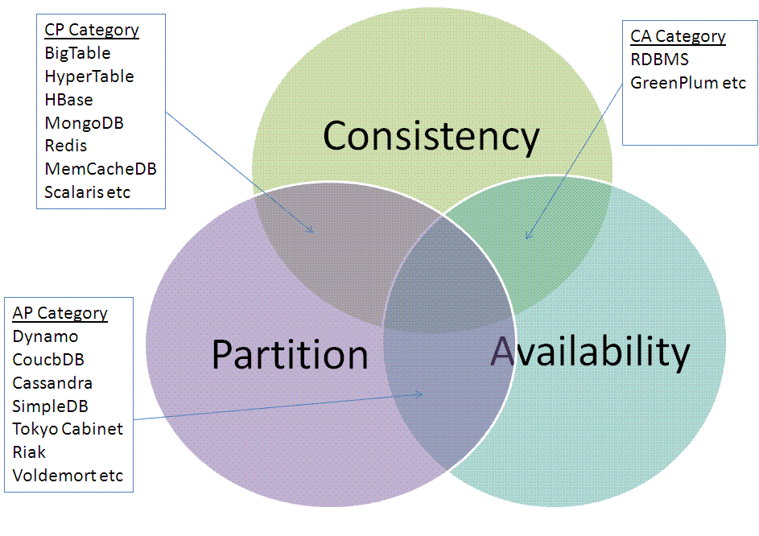

!SLIDE center

#Big Data

!SLIDE

* Qué es big data?
* Quién esta trabajando con big data?

!SLIDE bullets

* Logs
* Datos no-normalizados

!SLIDE

* Conteos
* Correlaciones
* Machine learning

!SLIDE bullets

* Guardar big data
* Procesar Big data

!SLIDE

#Guardar

##NoSQL

!SLIDE center
CAP

!SLIDE bullets

#Jugatela

* CP (consistency & partition tolareance)
* AP (availability & partition tolerance)

!SLIDE

#Procesar

##Map-Reduce for Dummies

!SLIDE bullets

## HADOOP

* Motor Map-Reduce
* HDFS
