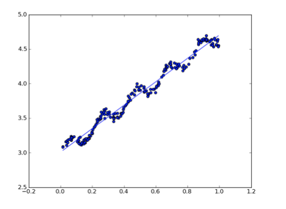
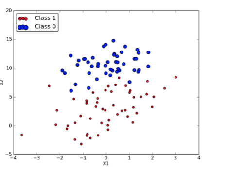
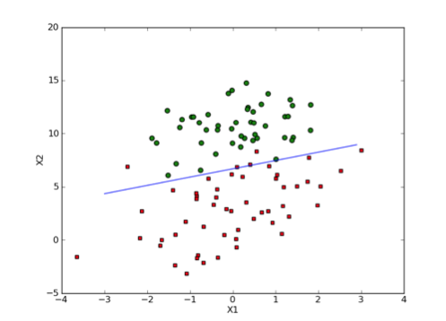
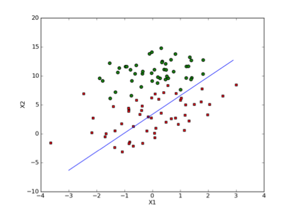

!SLIDE

Machine learning

!SLIDE

Supervised vs Unsupervised

!SLIDE

# Hablemos de Supervised

* Regresion
* Clasificacion

!SLIDE 

Que es regresion ? 

!SLIDE

Que es clasificacion?

!SLIDE center

## Un ejemplo de regresion

!SLIDE center

## Un ejemplo de clasificacion

!SLIDE center

## Un ejemplo de clasificacion (2)

!SLIDE 

## Dos tipos de algoritmos

*Offline
*Online

!SLIDE bullets

# Gradient Descent Clasificaction

* Algoritmo paso a paso
* Convergencia

!SLIDE center

## Gradient Descent

!SLIDE

# DEMO
