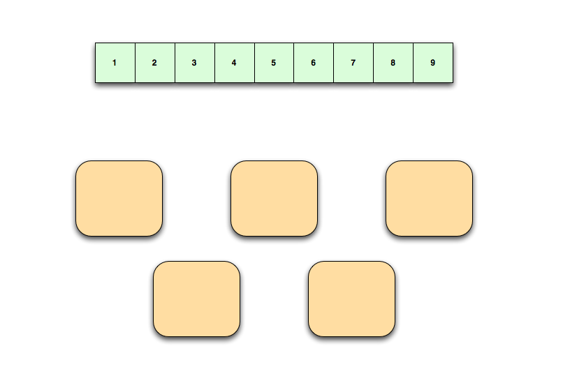
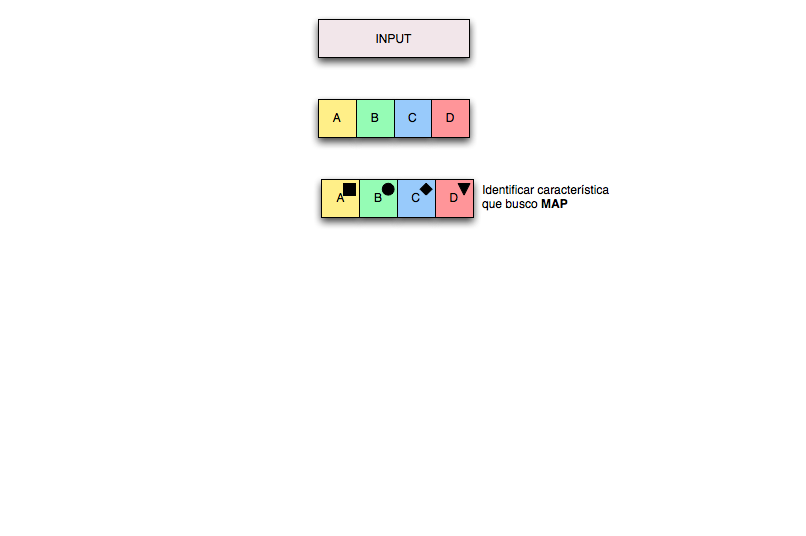
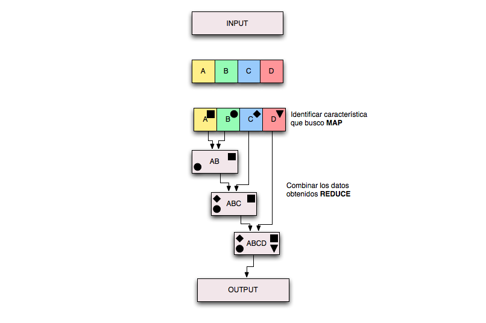

!SLIDE

# HDFS
## Hadoop Distrubuted File System

!SLIDE center
<!-- Una diferencia fundamental es que los bloques en HDFS no ocupan 4k como normalmente lo harian, por el contrario los bloques tienen entre 64 y 128 mb -->

!SLIDE center

!SLIDE center

!SLIDE center

!SLIDE center

!SLIDE center

!SLIDE center

## Facebook mantiene un HDFS de 21 PetaBytes

!SLIDE

# Map / Reduce
## En la práctica

!SLIDE center

!SLIDE center

!SLIDE center

!SLIDE center

!SLIDE center

!SLIDE center

!SLIDE center

!SLIDE
# Qué sentido tiene?

!SLIDE

## Procesar grandes cantidades de datos escalando horizontalmente

