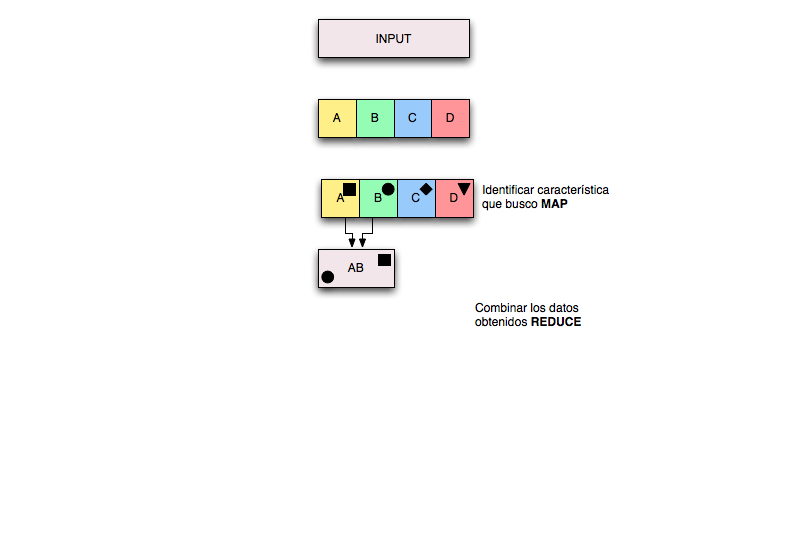
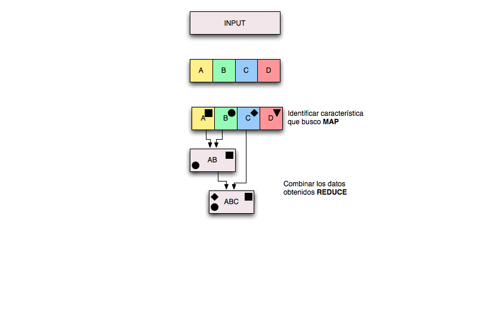

!SLIDE

HDFS

!SLIDE

MapReduce es un modelo de programacion con una implementacion asociada para el
procesamiento y generacion de grandes cantidades de datos. Se especifica
una funcion de mapeo que procesa un par clave/valor y una funcion de reduccion
que combina todas las partes.

Fuente: http://labs.google.com/papers/mapreduce.html

!SLIDE center

!SLIDE center

!SLIDE center

!SLIDE center

!SLIDE center

!SLIDE center

!SLIDE center

!SLIDE
# Que sentido tiene?

!SLIDE

## Procesar grandes cantidades de datos escalando horizontalmente

!SLIDE center

## Facebook mantiene un HDFS de 21 PetaBytes

